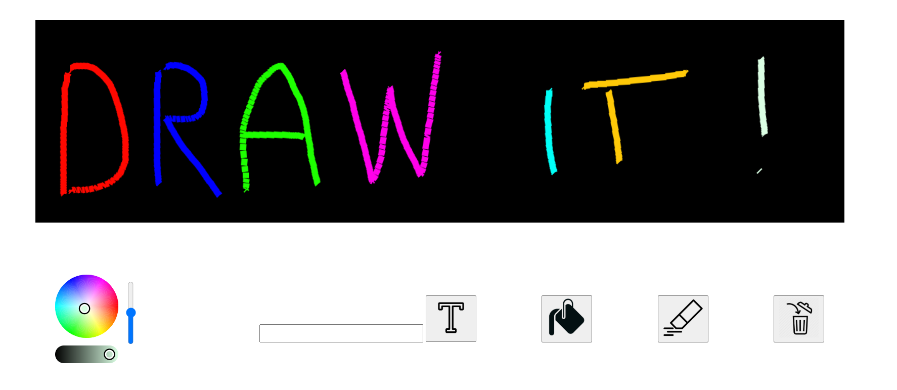
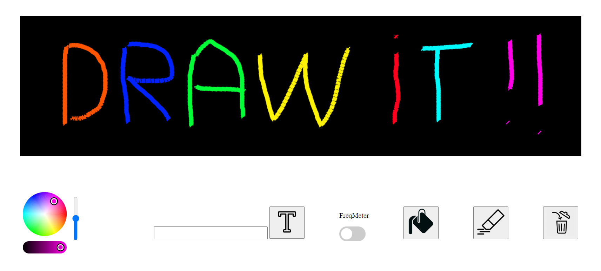

# Web Matrix
LEDs Matrix Arduino ESP32 controler over HTTP/WebSocket

Control via a Simple Web Interface :
  

TIP : To allow microphone to work on a local unsecured connection with chrome : https://medium.com/@Carmichaelize/enabling-the-microphone-camera-in-chrome-for-local-unsecure-origins-9c90c3149339)  



You also can send JSON data (via HTTP POST : http://IP:80 OR WebSocket : ws://IP:1234) to the device

Payload should be a JSON Array with one dict per instruction.
Example:
```
To apply instantly every command:  
[{"pos": [3, 8], "color":[200, 50, 0]}, {"pos": [6, 2], "color":[50, 50, 50]}, ...]  
  
Or to send a "program" that will repeat (5 times here from the idx 0 : begining) with 200 delay between every led instruction (blinking):  
[{"step": 42}, {"pos": [3, 8], "color":[200, 50, 0]}, {"delay": 500}, {"pos": [6, 2], "color":[50, 50, 50]}, {"delay": 200}, {"loop": [0, 5]}]
```

Commands:  
```
* [{"step": St},
*  {"clear": Cl},
*  {"pos": [X, Y], "color":[R, G, B]},
*  {"delay": T},
*  {"loop": [S, N]},
*  {"fill": [R, G, B]},
*  {"text": String}
]
```
 
With St and Cl any random number (no meaning),
Step mode need to be provided in first place to make the loop wait 10ms every iteration (program application),  
otherwise the loop will run wildly (real time application).  
X, Y a (int) position of a led,  
R, G, B a (int) color,  
T a (int) milliseconds delay,  
S the starting position of a loop, N the number of iteration of the loop  
If you provide a text of more than 5 chars, it will automatically be scrolled.  

Provide your Wifi credentials in the script or use SmartConfig to connect to your network.
At start the program try to connect to the provided network 5 times (red led slowly blinking).  
If failed, the device will enter in "SmartConfig" mode (orange led blinking fast).  
Connect with EspTouch application.
Green led blink one time on any successfull wifi connexion.

libraries needed:
```
SPIFFS -> https://github.com/pellepl/spiffs
WebServer -> https://github.com/espressif/arduino-esp32/tree/master/libraries/WebServer
WebSocketsServer 
ArduinoJson -> https://github.com/bblanchon/ArduinoJson
FastLED -> https://github.com/FastLED/FastLED
LEDMatrix -> https://github.com/AaronLiddiment/LEDMatrix
LEDText -> https://github.com/AaronLiddiment/LEDText
```
