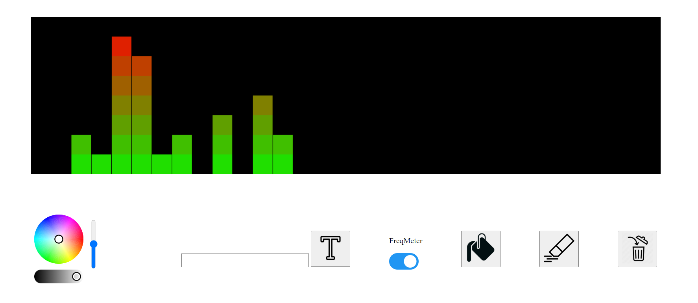

# Web Matrix
LEDs Matrix Arduino ESP32 controler over HTTP/WebSocket

Control via Simple Interface :


And/Or you can send JSON data (via HTTP POST : http://IP:80 or WebSocket : ws://IP:1234) to the device:
Commands:  
```
* [{"clear": C},
*  {"pos": [X, Y], "color":[R, G, B]},
*  {"delay": T},
*  {"loop": [S, N]},
*  {"fill": [R, G, B]},
*  {"text": String}
]
```
  
with C any random number,  
X, Y a (int) position of a led,  
R, G, B a (int) color,  
T a (int) milliseconds delay,  
S the starting position of a loop, N the number of iteration of the loop  
If you provide a text of more than 5 chars, it will automatically be scrolled.  

Provide your Wifi credentials in the script or use SmartConfig to connect to your network

libraries needed:
```
SPIFFS -> https://github.com/pellepl/spiffs
WebServer -> https://github.com/espressif/arduino-esp32/tree/master/libraries/WebServer
WebSocketsServer 
ArduinoJson -> https://github.com/bblanchon/ArduinoJson
FastLED -> https://github.com/FastLED/FastLED
LEDMatrix -> https://github.com/AaronLiddiment/LEDMatrix
LEDText -> https://github.com/AaronLiddiment/LEDText
```
